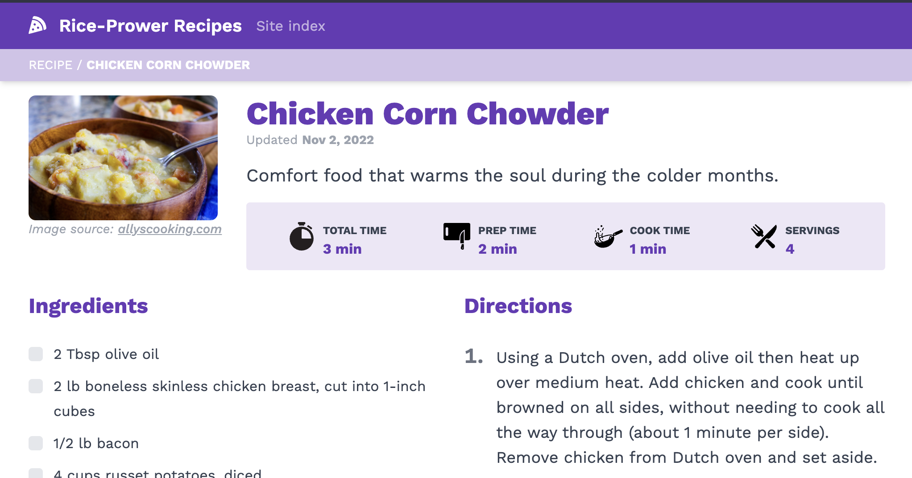
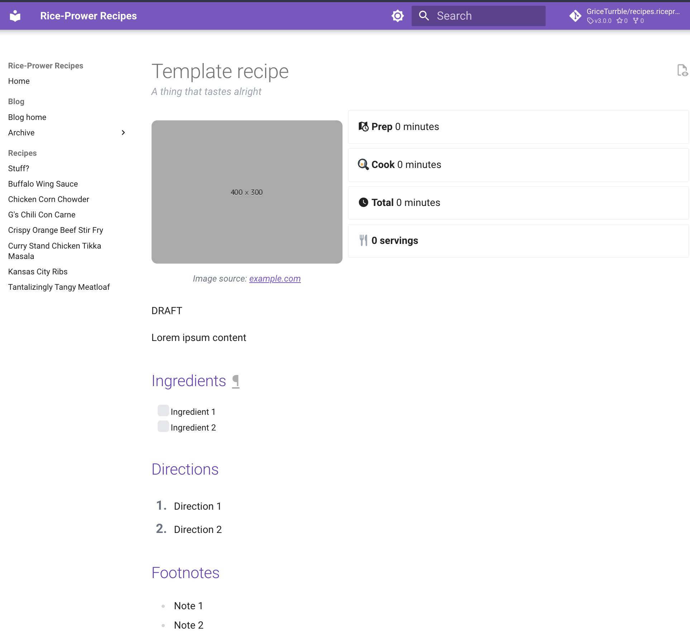

# New digs

The site has been refreshed with an honestly bland new look, but it's way easier for this techie to maintain.

<!-- more -->

I got frustrated trying to maintain this site using Jekyll. It was a neat system, but ultimately cumbersome due to my lack of interest in the Ruby ecosystem generally. I also had to get search features working with a lot of manual tinkering with Algolia, lots of theme customization by hand, and so on.

So I've done what any good dev would do: started from scratch! I've been using and learning more about [**MkDocs**](https://www.mkdocs.org/) and [**Material for MkDocs**](https://squidfunk.github.io/mkdocs-material/) specifically, so I decided to give it a go. Turns out it works just fine, even with the Tailwind styles I was using.

!!! note
    What follows below is some technical bits about how it's made.

    If you don't care, I'm not offended. :slight_smile:

## Generating content from metadata
### The old method

One thing I got working quite well in the old system was using metadata in the recipe files to generate the page. The actual Markdown content of any one recipe is usually very small, while all the ingredients, directions, images, etc., are listed in the meta.

For example:

```markdown title="Old template"
---
title: Glop
subtitle: It's glop!
image:
  href: https://place-hold.it/400x300
  alt: "placeholder image"
prep_minutes: 15
cook_minutes: 240
servings: 6
ingredients:
  - 1lb ground beef
  - ...
directions:
  - |
    Preheat oven to 225°F.
  - |
    ...
---

Lorem ipsum
```

In the old site, I parsed this through a page template (coded in Liquid because Jekyll), placing metadata values into different sections:

<figure markdown>
  { width="500" }
  <figcaption>Example of the old site</figcaption>
</figure>

### The new method
In the new setup, I initially started with a `mkdocs-gen-files` script to generate content, but as I finished it up I found that it was likely unsustainable. Yes it results in some clean YAML content for the recipe that drives a very standardized output, but any deviations from those standards would mean more tinkering with the internals to create new forks and such.

Ultimately I landed on a very similar template:

```markdown title="New template"
---
template: recipe.html
title: Template recipe
subtitle: A thing that tastes alright
image:
  href: https://place-hold.it/400x300.png
  alt: image alt text
  attribution:
    href: https://example.com
    name: example.com
stats:
  prep_minutes: 0
  cook_minutes: 5
  servings: 8
---

Lorem ipsum content

## Ingredients
<div class="recipe-ingredients" markdown>

- [ ] Ingredient 1
- [ ] Ingredient 2

</div>

## Directions
<div class="recipe-directions" markdown>

1. Direction 1
2. Direction 2

</div>
```

Which generates:

<figure markdown>
  { width="500" }
  <figcaption>Example of the new site</figcaption>
</figure>

There's some extra work at play here, namely in some Tailwind styles hooked to the divs in the output, and a custom template that injects recipe stats below the title.

I could have gone the route of generating all the content from metadata using the template system, but found that this content then no longer appears to the search plugin.

## New recipes coming soon

Now that the site is a lot easier to build, I can take more time tinkering with it, but of course also adding more recipe content that I've been meaning to. *Enjoy!*
