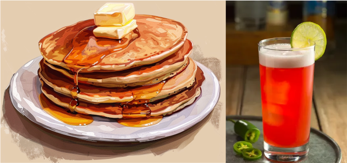

We recently asked our kids (currently 5 and 2 years old) to help with meal planning. For a Saturday evening, they suggested one of their favorites: **brekkie for dinner**! And when asked more specifically what we should make, **pancakes** was the answer.

<figure markdown>
  { width="600" }
</figure>

<!-- more -->

Rather than the usual internet search, I cracked open our new copy of [*The Complete America's Test Kitchen TV Show Cookbook*](https://www.amazon.com/dp/1954210612/) (no affiliate link) and found a recipe for pancakes there. In fact, I found a few: rather than having one recipe with addons like most books, they actually have a totally separate recipe for, say, blueberry pancakes (different amounts of eggs and milk, for instance). Fascinating stuff!

So we made the **Easy Pancakes**, but were out of maple syrup. So I looked around and found a simple recipe for **Brown Sugar Butter Syrup** to pair with it, and the result was simply amazing. So we've added both as a set: [Pancakes and Homemade Brown Sugar Butter Syrup](../../../recipes/pancakes_and_syrup.md)

---

Being the adults in the room, Molly and I splurged a little and shared a drink with dinner. [Mountain Punch](../../../recipes/mountain_punch.md) was on our radar for some time (written in an email one of us sent to the other years ago), so I finally wrote it up here. Enjoy!
