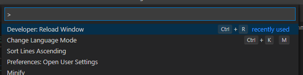
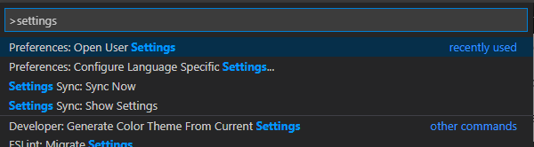
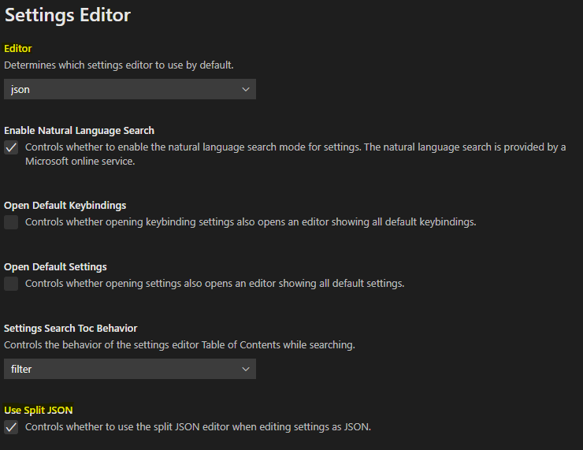
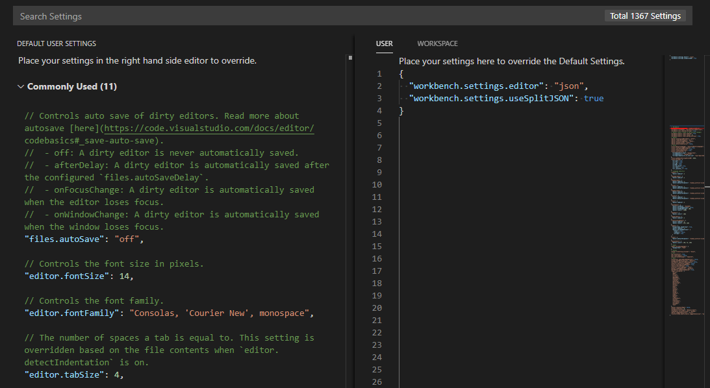
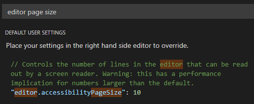
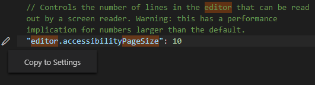
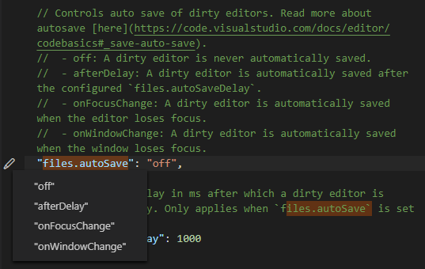

# Visual Studio Code recommended tooling

VS Code is an awesome editor (in this author's opinion), but it can be troublesome to get it set up right without some digging in source code and exploring options.

This doc aims to aid in getting started with development of this project using VS Code to its fullest potential.

If you are _not_ using VS Code, well, this isn't for you. Though perhaps in reading this and seeing what it can do, you might be convinced. I'm not here to evangelize (this time), so I'm not going to compare to other editors at this time.

## Table of Contents

- [Settings](#settings)
  * [How VS Code settings](#how-vs-code-settings)
    + [User vs Workspace settings](#user-vs-workspace-settings)
    + [Cascading SettingS (sic)](#cascading-settings--sic-)
    + [Opening the Settings Editor](#opening-the-settings-editor)
    + [Changing the look of the Settings Editor](#changing-the-look-of-the-settings-editor)
    + [Editing your settings](#editing-your-settings)
  * [Recommended settings](#recommended-settings)
    + [User settings](#user-settings)
    + [Workspace settings for RecipeSite project](#workspace-settings-for-recipesite-project)
- [Extensions](#extensions)

## Settings

VS Code as a deep set of settings available at multiple levels to help customize your working environment. Everything from the layout of the editor to color themes to behaviors when saving files to icons to... seriously, _everything_ gets stored in settings.

### How VS Code settings

At a low level, settings are stored in JSON format. The main two levels of settings we'll look at are **User settings** - settings that apply to the editor regardless of the files and folders you have open - and **Workspace settings** - settings that can be defined within a workspace to act as local overrides to User settings.

#### User vs Workspace settings

**User** settings are stored in a central location on your machine, applying those settings to every project you work on. This is where you might want to set your editor theme, font sizing, tab sizes, language-specific settings, and so on.

**Workspace** settings are stored inside a folder, within a `.vscode/settings.json` file. When you open that folder as your Workspace in VS Code, those settings get applied, allowing you to store project-specific settings within that project. Here you might place settings that tell extensions where to find certain things in the project or overrides that you prefer in that project compared to your user settings elsewhere.

In short, User settings mostly apply to *you*, while Workspace settings apply to the *project*.

#### Cascading SettingS (sic)

Settings are applied in the following order:

1. **defaults**: Everything in the default settings gets applied first, creating a baseline.
2. **User settings**: Settings you define here will override the defaults.
3. **Workspace settings**: Settings defined here override both the User and defaults.

Keep this in mind as you change settings. If you know you want a setting to be used every time you open VS Code, it should go in User settings. Otherwise, if the setting you're changing only matters for the project you're working on, it should go in Workspace settings.

#### Opening the Settings Editor

To access settings, you can open **File** > **Preferences** > **Settings** from the menu.

You can also get to settings using the **Command Palette**, which you can open by pressing `Ctrl-Shift-P`:



> Pressing `Ctrl-P` brings up a file search, which looks very similar. If you hit this by mistake, though, you can turn the file search into a Command Palette by typing `>` at the beginning of the line (as you can see in the example above).

Find "settings" by typing it in the search bar. As you type, matching commands will appear in the list:



Using the `Up`/`Down` arrows on your keyboard, select **Preferences: Open User Settings** and press `Enter`.

Regardless of how you get there, a new tab will open showing your settings. By default, that tab looks something like this.


#### Changing the look of the Settings Editor

In this author's opinion, the default settings view is visually good and easy to navigate, but it does a poor job of showing the settings you've overridden compared to defaults; and it's more difficult to share settings from one setup to another.

I personally recommend changing the settings display in two ways:

1. Under **Workbench** > **Settings Editor**, change the **Editor** setting to "json".
2. In the same window, scroll down to **Use Split JSON**, and click the checkbox.



Once set, close the tab and re-open settings. You should now see this:



This view shows you all default settings on the left side, and any settings you've changed on the right, all in JSON format. The right half is further separated into tabs for **User** and **Workspace**.

> Even if you don't have Workspace settings saved in the current project, writing anything in the Workspace tab will create a `.vscode/settings.json` file automatically at the project root.

#### Editing your settings

There are a few ways to edit the settings in the split JSON view. First, you can simply write in the settings on the right side of the screen. VS Code will try to help you with autocompletion for both the settings name and its possible values. You can also copy-paste JSON settings you find in my Recommendations (below) directly into the editor.

You can also use the **Search Settings** field at the top of the tab to find any setting. The list of defaults on the left-hand side will condense into only the settings that match your search terms.

For example, searching for something like "editor page size", you can see how it picks apart the term and matches it to different parts of the setting name and comments to try to find what you want:



When looking at available settings, hovering on any setting in the list of defaults will show a pencil icon. You can click this to get an option to copy that setting to your own settings (whichever tab on the right is currently open):



Some settings can only have certain values, such as a predefined set of values or a simple `true`/`false` boolean flag. In these cases, clicking the pencil will let you choose one of those options, allowing you to easily change your settings to that value:



### Recommended settings

Now that we've gone over the basics, let's get to the heart of things.

> In each of the examples below, ignore the `{` at the top and `}` at the bottom of the code block. These are included here just so syntax highlighting works as expected.

#### User settings

The following is my full set of recommended settings, which can be copy-pasted right into your `User settings` JSON view:

```jsonc
{
  // Adjusting the settings editor so you can actually copy over these settings and not waste time.
  "workbench.settings.editor": "json",
  "workbench.settings.useSplitJSON": true,

  // By default, the editor tries to be helpful with closing brackets and quotes and such.
  // This turns some of those settings off
  "editor.autoClosingBrackets": "never",
  "editor.autoClosingQuotes": "never",
  "editor.autoSurround": "never",
  "editor.detectIndentation": false,

  // I prefer to show the whitespace in the file, so I know what's a space and what's a tab.
  // (remove if you don't)
  "editor.renderWhitespace": "all",

  // The editor's autocompletion by default will do a "recently used" thing I don't like,
  // as it tries to be too smart and trips over itself, I find.
  // This setting changes it so it just uses the first option it finds, which is more consistent.
  "editor.suggestSelection": "first",

  // When you save a file, these will remove trailing whitespace on lines...
  "files.trimTrailingWhitespace": true,
  // ...ensure a blank newline is at the end of the file...
  "files.insertFinalNewline": true,
  // ...and remove extra newlines at the end of the file, if present.
  "files.trimFinalNewlines": true,

  // These file associations are useful particularly for the Django extension.
  "files.associations": {
    "**/templates/*.html": "django-html",
    "**/templates/*": "django-txt",
    "**/requirements{/**,*}.{txt,in}": "pip-requirements"
  },

  // This hides some files from the Explorer view, so you don't have to touch them.
  // This is mostly the same as defaults, with some additions related to Python.
  "files.exclude": {
    "**/.git": true,
    "**/.svn": true,
    "**/.hg": true,
    "**/CVS": true,
    "**/.DS_Store": true,
    "**/.venv/": true,
    "**/__pycache__/": true
  },

  // Language specifics. Notes on these:
  // editor.tabSize: There is a default we aren't touching called editor.insertSpaces (set to true),
  //   which inserts spaces when you hit the Tab key. So .tabSize changes how many spaces are added
  //   when you press Tab, as well as where the breakpoints are to indicate indentation levels
  // editor.defaultFormatter: esbenp.prettier-vscode is from an extension called Prettier,
  //   which I also recommend. This setting tells the editor how to reformat a file when we
  //   use an auto-formatting command (G can demonstrate).
  "[html]": {
    "editor.tabSize": 2
  },
  "[django-html]": {
    "editor.tabSize": 2
  },
  "[css]": {
    "editor.tabSize": 2
  },
  "[javascript]": {
    "editor.tabSize": 2,
    "editor.defaultFormatter": "esbenp.prettier-vscode"
  },
  "[json]": {
    "editor.tabSize": 2,
    "editor.defaultFormatter": "esbenp.prettier-vscode"
  },
  "[jsonc]": {
    "editor.tabSize": 2,
    "editor.defaultFormatter": "esbenp.prettier-vscode"
  },
  // Specific to Markdown files, I set the wordWrap and turn off the quickSuggestions, making it
  // easier to write without worrying too much about spacing
  "[markdown]": {
    "editor.wordWrap": "bounded",
    "editor.quickSuggestions": false,
    "editor.wordWrapColumn": 100,
    "editor.rulers": [100]
  },

  // Python gets its own special settings outside the [language] stuff.
  // Black is a code formatter. Installed as part of the dev requirements for the project.
  "python.formatting.provider": "black",

  // Pylance helps with code completion, inspecting functions, and some other linting features.
  "python.languageServer": "Pylance",

  // Git integration is very good in VS Code, and it's necessary to use this project locally.
  // Autofetch runs a background task to check for updates from the GitHub repo
  "git.autofetch": true,

  // Emmet is a plugin that lets you some boilerplate code using snippets, handy for HTML.
  // We won't get into details, but this setting tells the editor to use the same Emmet snippets
  // for the Django extension as for standard HTML files.
  "emmet.includeLanguages": {
    "django-html": "html"
  },
}
```

#### Workspace settings for RecipeSite project

And the following are what I use in the workspace settings for RecipeSite:

```json
{
  // When opening a terminal, usually it will open the root folder of the project.
  // Django projects typically have a manage.py file we need to use for most commands,
  // and that file is usually one folder down.
  // This specifies where the command line starts from when we open a terminal, so we don't
  // have to add the step of navigating to that subfolder every time.
  "terminal.integrated.cwd": "${workspaceFolder}\\recipesite",

  // These extra paths help our autocompletion and Pylance tooling to know where to find stuff
  // within the project. Otherwise, it would throw errors like "cannot resolve this import"
  // even though project has no problem doing so at runtime.
  "python.autoComplete.extraPaths": ["./recipesite"],
  "python.analysis.extraPaths": ["./recipesite"],

  // The default linter in VS Code is pylint, but I've started preferring flake8, instead.
  // This swaps pylint off and flake8 on.
  // (flake8 gets installed by dev requirements in this project)
  "python.linting.pylintEnabled": false,
  "python.linting.flake8Enabled": true
}
```

## Extensions

*TODO*
